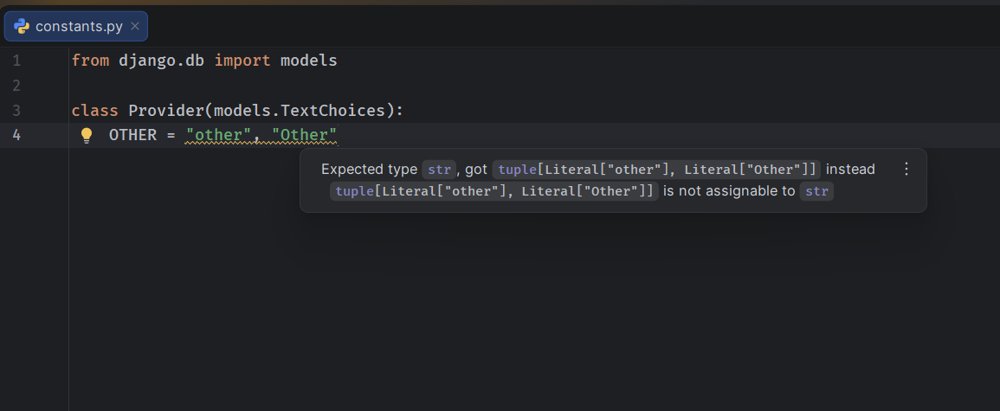

# Django-Example

Minimal reproduction repo for a PyCharm false-positive type-checking warning on
`django.db.models.TextChoices`.

## The issue

Open [`example/utils/constants.py`](example/utils/constants.py) and look at the
`Provider` class:

```python
from django.db import models

class Provider(models.TextChoices):
    OTHER = "other", "Other"
```

PyCharm's type checker flags the `OTHER` member with:

> Expected type `str`, got `tuple[Literal["other"], Literal["Other"]]` instead
> `tuple[Literal["other"], Literal["Other"]]` is not assignable to `str`

This is a false positive. Django's `ChoicesType` metaclass
(`django/db/models/enums.py`) rewrites the `(value, label)` tuple in the class
body before the enum machinery builds the member — the label is stripped off
and stored separately as `_label_`, so at runtime `Provider.OTHER.value` is
just `"other"`. PyCharm's static analysis doesn't account for this metaclass
rewrite and infers the type straight from the tuple literal.

## Environment

- PyCharm 2026.2
- Python 3.14.7
- Django 6.1.1

## Reproducing

1. Clone this repo and open it in PyCharm.
2. Point the project interpreter at `.venv` (or run `uv sync`).
3. Open `example/utils/constants.py`.
4. The warning appears on the `OTHER = "other", "Other"` line.



## Tracking issue

[PY-92177](https://youtrack.jetbrains.com/issue/PY-92177) — confirmed by JetBrains
as a bug, assigned to a developer, no fix build yet.